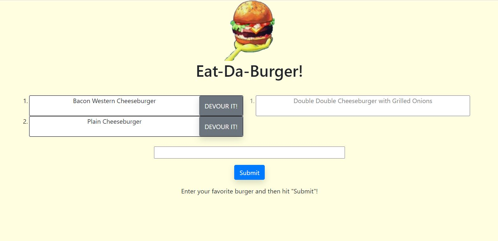

# Burger Logger
UCI Boot Camp Homework 13 - Burger Logger

Click [here](https://maxx-burger-logger.herokuapp.com/) to open deployed Heroku application.

## Description 
 This was the thirteenth homework assignment for the full stack web development program at UC Irvine, in which the goal was to build a full stack application that allows the user to enter a burger name which will render it to the left side of the screen. It will also render a "devour it" button for each burger and when that it pressed, it will remove the burger and render it to the right side of the screen. This appication features the use of MySQL (for database manipulation), Node, Express, Handlebars, and ORMs.

## Table of Contents 
* [Technologies](#Technologies)
* [Usage](#Usage)
* [License](#License)
* [Badges](#Badges)
* [Tests](#Tests)
* [Future Development](#Future-Development)
* [Questions](#Questions)

## Technologies 
* This application is written in Javascript and uses MySQL for creating, reading, and updating data from a database.
* It uses CSS for styling as well as the Bootstrap framework.
* It uses the JQuery framework as well as AJAX for API calls.
* This application uses the mysql, express, and handlebars npm modules. 
* It requires node.js to run it.
* It also makes use of the MVC folder structure.

## Usage 
If using from the Heroku deployed application, just go to the deployed application's [link](https://maxx-burger-logger.herokuapp.com/). Type the name of a burger in the input field and click submit. It will render that burger's name to the left side the screen along with a "Devour it!" button. When that button is pressed, it will remove it from the left side of the screen and place it on the right side. If running off a local server, run the server by running the "node server.js" command in a gitbash terminal. Then navigate to a browser and go to http://localhost:3000/ to render it.

## License 
 ISC

## Badges 
 
 

## Tests 
 No tests are currently in place for this project.

 ## Future Development
 For future development, I would like to add a delete function to delete burgers from the table.

## Questions 
 For any questions, contact me at [maxxsanner105@gmail.com](mailto:maxxsanner105@gmail.com).
#### 
